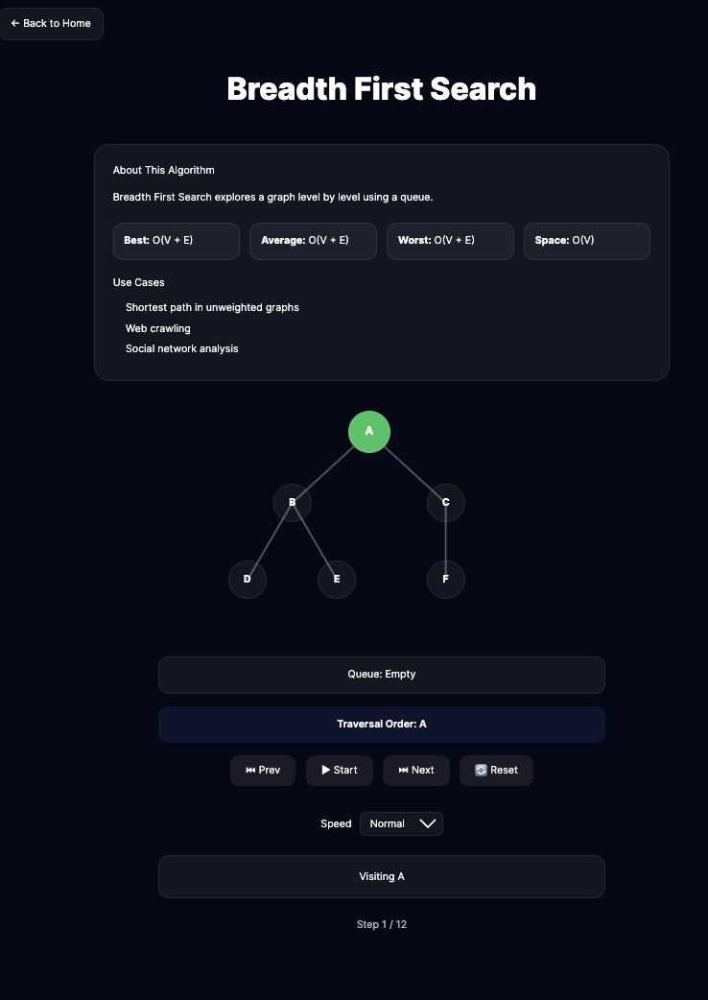
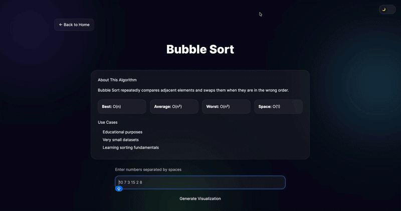
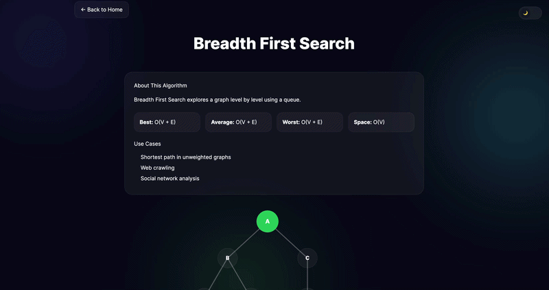
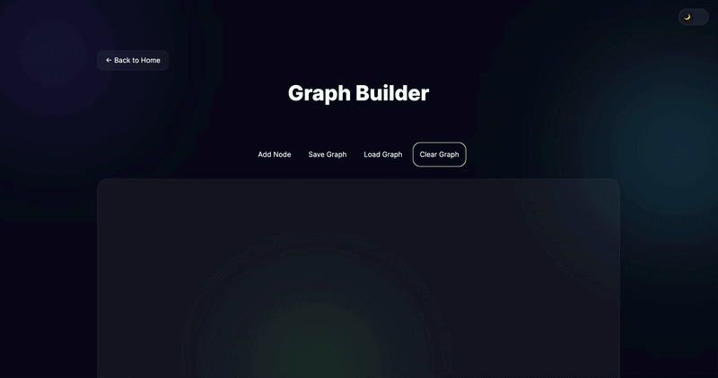

# 🚀 Algorithm Visualizer

An interactive platform for learning and visualizing algorithms through animations, step-by-step execution, and custom graph exploration.

Built with React, Vite, and modern UI principles to help students, developers, and computer science enthusiasts understand how algorithms work visually.

---

## ✨ Features

### 🔢 Sorting Algorithms

- Bubble Sort Visualization
- Selection Sort Visualization
- Step-by-step execution
- Playback controls
- Adjustable animation speed

---

### 🔍 Searching Algorithms

- Binary Search Visualization
- Interactive traversal display
- Execution explanation for every step

---

### 🌐 Graph Algorithms

#### Breadth First Search (BFS)

- Visual traversal
- Queue visualization
- Current node highlighting
- Visited nodes tracking

#### Depth First Search (DFS)

- Visual traversal
- Stack visualization
- Recursive exploration animation
- Step-by-step playback

---

### 🔬 Graph Builder Lab

Create and explore your own graph interactively.

Features:

- Add Nodes
- Create Edges
- Move Nodes using Drag & Drop
- Select Start Node
- Run BFS
- Run DFS
- Queue Visualization
- Stack Visualization
- Traversal Tracking
- Auto Save
- Auto Load
- Clear Graph
- Playback Controls

---

### 📊 Algorithm Comparison

Compare algorithms side by side and analyze their behavior.

Current comparisons:

- Bubble Sort vs Selection Sort

---

### 🎨 Modern UI

- Responsive Design
- Glassmorphism Components
- Smooth Animations with Framer Motion
- Dark Theme
- Mobile Friendly

---

## 🛠️ Tech Stack

### Frontend

- React
- Vite
- React Router
- Framer Motion

### Styling

- CSS Modules
- Custom Design System

### State Management

- React Hooks

### Deployment

- Vercel

---

## 📁 Project Structure

```bash
src/
│
├── algorithms/
├── components/
├── pages/
├── routes/
├── hooks/
├── data/
├── layouts/
├── styles/
└── utils/
```

---

## 🚀 Getting Started

Clone the repository:

```bash
git clone https://github.com/yourusername/algorithm-visualizer.git
```

Install dependencies:

```bash
npm install
```

Run development server:

```bash
npm run dev
```

Build production version:

```bash
npm run build
```

---

## 📈 Roadmap

### Phase 1 ✅

- Bubble Sort
- Selection Sort
- Binary Search
- BFS
- DFS
- Comparison Page

### Phase 2 ✅

- Interactive Graph Builder
- Custom BFS
- Custom DFS
- Drag & Drop Nodes
- Graph Persistence

### Phase 3 🚧

- Dijkstra Shortest Path
- Weighted Graphs
- Edge Weight Editor
- Path Highlighting

### Phase 4 🚧

- Merge Sort
- Quick Sort
- Heap Sort

### Phase 5 🚧

- AVL Tree Visualizer
- Binary Search Tree Visualizer
- Red Black Tree Visualizer

### Phase 6 🚧

- A\* Pathfinding
- Prim's Algorithm
- Kruskal's Algorithm

### Phase 7 🚧

- User Accounts
- Saved Projects
- Graph Sharing
- Export / Import Graphs

---

## 🖥️ Screenshots

### 🌞 Light Mode


### 🌙 Dark Mode


### 🔄 Bubble Sort Visualization


### 🌐 BFS Visualization



### 🕸️ Graph Builder


---

## 🚀 Algorithm Animations

### Bubble Sort



### BFS Traversal



### Graph Builder



---

## 🎯 Educational Goals

This project aims to make algorithms easier to understand through visual learning and interactive experimentation.

Users can:

- Build their own graphs
- Explore traversal algorithms
- Compare algorithm behavior
- Learn data structures visually

---

## 🤝 Contributing

Contributions, issues, and feature requests are welcome.

Feel free to fork the project and submit a pull request.

---

## ⭐ Support

If you find this project useful:

- Star the repository
- Share it with friends
- Suggest new algorithms

---

# Author

Ahmed Djabrane Mammadi
Frontend Developer passionate about building modern web experiences.

---

## 📜 License

MIT License

---

Made with ❤️ for Computer Science Students
